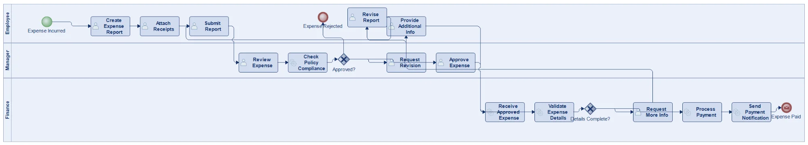

# Modelio BPMN Generator with Claude, ChatGPT, or Gemini AI

Generate BPMN (Business Process Model and Notation) diagrams in [Modelio](https://www.modelio.org/) using Claude AI. This project provides templates, instructions, and examples for creating professional BPMN process diagrams through natural language conversations with Claude.



## Overview

This project enables you to:

- **Describe a business process in plain language** and have Claude, ChatGPT, or Gemini generate the Modelio macro
- **Automatically create BPMN diagrams** with lanes, tasks, gateways, and flows
- **Customize layout** with configurable spacing, task dimensions, and positioning

## Features

- ✅ Support for all common BPMN elements (Start/End Events, User/Service/Manual Tasks, Gateways)
- ✅ Automatic swim lane creation and element positioning
- ✅ Sequence flows with labels for gateway decisions
- ✅ Configurable task dimensions and spacing
- ✅ Robust element unmasking with fallback mechanisms
- ✅ Detailed debug logging for troubleshooting

## Requirements

- [Modelio](https://www.modelio.org/) 5.0 or later
- Access to [Claude](https://claude.ai/), [ChatGPT](https://chat.openai.com/) with GPT-4o, or [Gemini](https://gemini.google.com/) (for macro generation). 
- Also works with Qwen via LM Studio—see the guide [here](lm_studio/LMStudio_Qwen_Guide_v5_Final.md).

## Quick Start

### 1. Set Up Claude, ChatGPT, or Gemini

Copy the contents of [`CLAUDE_INSTRUCTIONS.md`](CLAUDE_INSTRUCTIONS.md) into either:

- **Claude**: A Project's custom instructions (original format is written for Claude).
- **ChatGPT**: The Custom instructions or first system message for a GPT-4o chat. No edits are needed; the prompt works as-is.
- **Gemini**: A new chat as the system/developer message or custom instructions. No edits are needed; the prompt works as-is.
- **LM Studio + Qwen**: Use the dedicated setup and prompt in [`lm_studio/LMStudio_Qwen_Guide_v5_Final.md`](lm_studio/LMStudio_Qwen_Guide_v5_Final.md).

Suggested starter message (ChatGPT or Gemini): "You are generating Modelio Jython BPMN macros. Follow these instructions exactly and reply with the full Python script only."

### 2. Describe Your Process

In Claude, describe your business process. For example:

> "Create a BPMN diagram for an expense approval process with 3 lanes: Employee, Manager, and Finance. The employee submits an expense report, the manager reviews and approves or rejects it, and finance processes the payment."

### 3. Run the Generated Macro

1. Copy the generated Python script
2. In Modelio, go to **Script > Run Script**
3. Select a Package in the model
4. Run the macro

## Project Structure

```
├── README.md                    # This file
├── CLAUDE_INSTRUCTIONS.md       # Instructions for Claude AI
├── templates/
│   └── BPMN_Template.py         # Base template for BPMN macros
├── examples/
│   └── ExpenseApprovalProcess.py # Complete working example
└── docs/
    └── images/                  # Screenshots and diagrams
```

## Files Description

| File | Purpose |
|------|---------|
| `CLAUDE_INSTRUCTIONS.md` | Master prompt for Claude - teaches it how to generate Modelio BPMN macros |
| `BPMN_Template.py` | Reusable template with all helper functions |
| `ExpenseApprovalProcess.py` | Complete example of a 3-lane expense approval workflow |

## Configuration

The scripts include configurable parameters at the top:

```python
# Waiting configuration for auto-unmask
WAIT_TIME_MS = 50           # Time between attempts (milliseconds)
MAX_ATTEMPTS = 3            # Maximum attempts to wait

# Layout configuration
SPACING = 150               # Horizontal spacing between elements
START_X = 80                # Starting X position

# Task dimensions
TASK_WIDTH = 120            # Width for task elements
TASK_HEIGHT = 60            # Height for task elements
```

## How It Works

### Modelio Auto-Unmask Behavior

When a BPMN diagram is created in Modelio, elements are automatically "unmasked" (made visible). However:

- **Auto-unmask is random** - sometimes all elements appear, sometimes only some
- **Waiting doesn't help** - Modelio seems to freeze in a state where waiting has no effect
- **Solution**: Manually unmask missing elements at the correct Y position inside their lane

### The Workflow

```
1. Create Process & Lanes
2. Create BPMN Elements & assign to lanes (addToLane)
3. Create Diagram (triggers random auto-unmask)
4. Quick check for available elements (3 attempts, 50ms each)
5. Manual unmask for missing elements (INSIDE correct lane Y position)
6. Reposition all elements to target positions
7. Create sequence flows
```

### Critical Discovery

**Manual unmask must be done at a Y position inside the correct lane!**

```python
# WRONG - will fail
result = diagramHandle.unmask(elem, 0, 0)

# CORRECT - unmask inside the lane
targetY = laneY[laneName]  # e.g., 161 for Manager lane
result = diagramHandle.unmask(elem, 100, targetY)
```

## Available BPMN Elements

| Function | Icon | Description |
|----------|------|-------------|
| `createStartEvent` | ○ | Process start (green circle) |
| `createEndEvent` | ◉ | Process end (red circle) |
| `createMessageStartEvent` | ✉○ | Start triggered by message |
| `createMessageEndEvent` | ✉◉ | End that sends message |
| `createTimerStartEvent` | ⏱○ | Start triggered by schedule |
| `createUserTask` | 👤▭ | Human activity with IT system |
| `createManualTask` | ✋▭ | Physical task without IT |
| `createServiceTask` | ⚙▭ | Automated/system task |
| `createExclusiveGateway` | ◇ | XOR decision (one path) |
| `createParallelGateway` | ⊕ | AND split/join (all paths) |

## Example Output

Running the ExpenseApprovalProcess example produces:

```
==================================================================
BPMN EXPENSE APPROVAL PROCESS
==================================================================
Script Version: v9.0
Execution ID:   83950
Process Name:   ExpenseApproval_83950
==================================================================

== PHASE 1: CREATE PROCESS & LANES ==============================
[1] Process: ExpenseApproval_83950
[2] Lanes: Employee, Manager, Finance

== PHASE 2: CREATE ELEMENTS =====================================
[3] Employee lane: 7 elements
[4] Manager lane: 5 elements
[5] Finance lane: 7 elements
  Total elements: 19

== PHASE 3: CREATE DIAGRAM ======================================
[6] Diagram created: ExpenseApproval_83950

== PHASE 4: WAIT FOR AUTO-UNMASK ================================
[9] Waiting for elements (max 3 attempts, 50ms interval)...
  [Attempt 1] Found: 7/19 | Missing: Review Expen, Check Policy...

[11] Trying manual unmask for missing elements...
  [Unmask] Review Expense -> Y=161 (Manager): OK
  [Unmask] Check Policy Compliance -> Y=161 (Manager): OK
  ...
[13] All elements now available

== PHASE 5: REPOSITION ELEMENTS =================================
[17] Employee/Create Expense Report -> (230,35) 120x60
[18] Employee/Attach Receipts -> (380,35) 120x60
...
  Repositioned: 19/19

== PHASE 6: CREATE FLOWS ========================================
[36] Created 20 sequence flows

==================================================================
COMPLETE
==================================================================
```

## Troubleshooting

| Problem | Solution |
|---------|----------|
| UnicodeDecodeError | Use ASCII only in print statements - no special characters |
| Element in wrong lane | Check `addToLane()` call and lane name spelling |
| Element not visible | Manual unmask handles this automatically |
| Manual unmask fails | Must unmask at Y position INSIDE the correct lane |
| Layout mismatch | Check elementLayout lane names match exactly (case-sensitive) |
| Elements overlap | Increase SPACING or adjust column indices |
| Text doesn't fit | Increase TASK_WIDTH and TASK_HEIGHT |

## Contributing

Contributions are welcome! Please feel free to submit issues and pull requests.

## Acknowledgments

- [Modelio](https://www.modelio.org/) - Open source modeling environment
- [Anthropic Claude](https://www.anthropic.com/) - AI assistant used for code generation
- Modelio development team for insights on auto-unmask behavior
- [MATISSE](https://matisse-kdt.eu/) - Project co-funded by the European Union under the Key Digital Technologies Joint Undertaking and participating national authorities (Grant Agreement ID: 101140216)


## Version History

- **v0.9.1** (Dec 2025) - Guards for gateway conditions
- **v0.9.0** (Dec 2025) - Configurable task dimensions
- **v0.8.3** (Dec 2025) - Manual unmask inside correct lane Y position
- **v0.8.0** (Dec 2025) - Auto-unmask discovery and waiting mechanism
- **v0.3.0** (Nov 2025) - Template with complete helper functions
